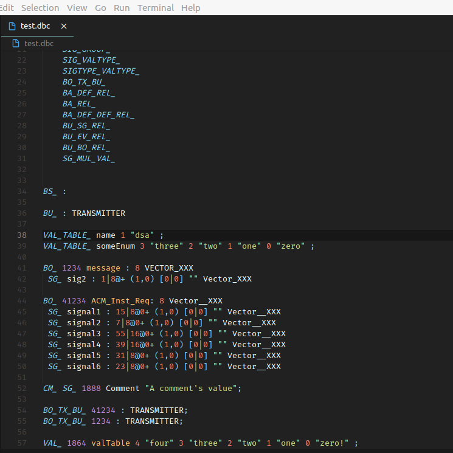
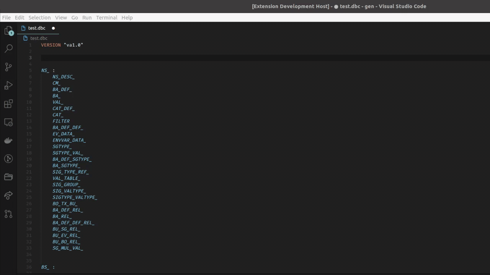
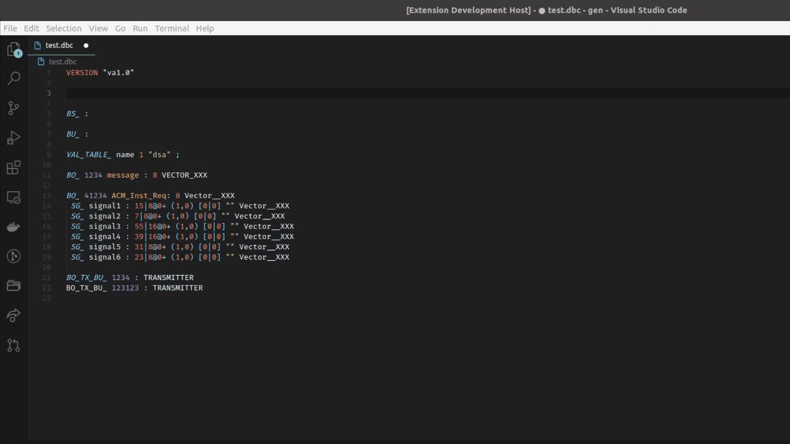

# DBC Language Syntax

This extension provides basic syntax highlighting, bracket completion, code snippets 
and lexer/parser errors for the Vector DBC file format. 
This is created to work with version 2 of the [Vector DBC file format](https://bitbucket.org/tobylorenz/vector_dbc/src/master/).

Although DBC files are often programmatically generated, it can be useful to
more easily read the DBC file itself in a plaintext format. 
Syntax highlighting is handled locally through VSCode's 
integrated TextMates language parsing engine, using PCRE regular 
expressions to match syntax. 

## Syntax Highlighting

## Lexicographic and Parser Errors

## Commonly Used Snippets

## Supported keywords
- BA
- BA_DEF
- BA_DEF_DEF
- BA_DEF_DEF_REL
- BA_DEF_REL
- BA_REL
- BO
- BO_TX_BU
- BS
- BU
- BU_SG_REL
- CM
- EV
- NS
- SG
- SGTYPE
- SIG_GROUP
- VAL
- VAL_TABLE
- VERSION
## Known Issues
1. Attribute definitions that wrap lines may not be highlighted on the following
   lines. 
1. Signals that are multiplexed will not be recognized

## Todo items
- Include debugging (invalid offset, start bit, min, max, etc)
- Hover box to show all related fields as a hint

## License
GNU General Public License v2.0 only
